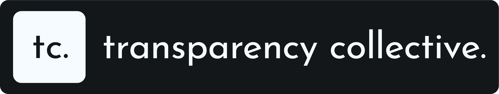

### Democratizing Information. Enforcing Accountability.

 

&nbsp;

&nbsp;

---

## About the Collective

We are a pan-India non-profit collective of journalists, lawyers, software developers, and concerned citizens. We use the **Right to Information (RTI) Act** as a tool to investigate governance, fight corruption, and promote transparency across the country.

This repository serves as our **Open Public Record**. It functions as a live tracker of every inquiry we file, the government's response, and the subsequent analysis. We operate with strict adherence to journalistic values: unbiased, neutral, and fact-based.

**[🔎 Browse Issues](https://github.com/TransparencyCollective/RTIs/issues) &nbsp;·&nbsp; [🗓️ Live Roadmap](https://github.com/orgs/TransparencyCollective/projects/1/views/4) &nbsp;·&nbsp; [📄 File a New Request](https://github.com/TransparencyCollective/RTIs/issues/new/choose) &nbsp;·&nbsp; [📊 View Analytics](https://github.com/TransparencyCollective/RTIs/pulse)**

---

## Tech & Methodology

We do not just file paper; we digitize accountability. We leverage AI and modern software stacks to process the vast amounts of data returned by government offices.

**Digitization & OCR**
We convert physical government scans and hard copies into machine-readable, searchable text. This allows us to index documents that were previously locked in dusty files.

**Anomaly Detection**
Our systems analyze public spending logs, muster rolls, and attendance registers to spot statistical irregularities. We look for patterns that indicate corruption, ghost employees, or fund diversion.

**Cross-Referencing**
We link disconnected datasets across districts and states to identify systemic issues. By connecting the dots between isolated RTI responses, we reveal the larger picture of governance in India.

---

## Roles & Opportunities

We are building a decentralized network of transparency advocates from every corner of India. **No formal qualifications are required.** We value persistence over credentials.

### On-Ground Investigation
Verify official records against reality. If a document says a road was built, go there and photograph it. Call departments, visit sites, and document findings to corroborate the data.

### Advocacy & Hearings
We need persistent individuals to follow up on stalled cases. This involves attending First Appeals, appearing for hearings at State Information Commissions (SIC) or the Central Information Commission (CIC), and legally arguing for the release of information.

### Mutual Filing
We file for each other. To protect the identity of activists in sensitive areas or to overcome geographical barriers, members file RTIs on behalf of others. You might file a request for a colleague in a different state, and they will do the same for you.

### Engineering & Analysis
Build tools to scrape portals, visualize budgets, and automate the pipeline. Deep-dive into raw documents to find the story and help us publish public-interest reports.

---

**Neutrality** &nbsp;|&nbsp; **Persistence** &nbsp;|&nbsp; **Open Access**

 

Built for maximum transparency.
 
© 2026 Transparency Collective. 🇮🇳

